# Overview

Welcome! This is the long format of Kyle Zeeuwen's resume. It contains A LOT of info!
* Future Work: the short format
* Future Work: A web version

Did you know: github markdown viewer include a table of contents / header summary  (↖ over there ↖)

# Technologies

## Languages
* javascript - Advanced - 10+ year
* nodejs - Advanced - 10+ year
* perl - Advanced - Never again - 6 year
* python - Novice/Intermediate - 5 year
* HTML5/CSS - Intermediate - 10+ year 
* Java - Beginner - 1 year
* C/C++ - Beginner - 3 year

## Database
* MySQL - Advanced - 14+ year
* hadoop + Hbase - 2 year
* elasticsearch - Beginner - 3 year
* redshift - Beginner - 3 months

## Javascript / Nodejs Frameworks
* AngularJS (1.x) - Advanced - 10+ year
* React - Intermediate - 4+ year
* D3 - Novice/Intermediate - 3 year
* Grunt/Gulp Tooling - Advanced - 5 year
* Protractor - Intermediate - 4 year
* Testing with chai/sinon/mocha or jasmine - 4 year
* Puppeteer - Beginner - 2 year

## Data Engineering / Data Science Frameworks 
* DBT - Beginner - 4 months
* Pandas / Numpy / ScikitLearn - Beginner - 1 year

## Build/Devops
* git - advanced - 8 year
* AWS - Novice/Intermediate - 5 year
* Ansible - Beginner - 3 year
* Nagios - Advanced - 6 year
* Jenkins - Intermediate - 6 year
* Perforce - 6 year
* Linux packaging - 2 year

# Experience

## Full Time Employment

### Console - 2014 → Present
  * Role: Front End Developer → Tech Lead → Practice Lead → Squad Lead → Squad Lead Coordinator → Data Guy
  * Who: [Console](https://www.console.com.au/) formerly [OnTheHouse](https://www.onthehouse.com.au/)
  * When: May 2014 - Present
  * Where: Sydney, Australia + Brisbane, Australia

It's been an 8 year journey spanning two cities, 5 CEOs, 6 roles, and two complete rewrites of legacy products: the [www.onthehouse.com.au](www.onthehouse.com.au) site and the [Console Cloud property management platform](https://www.console.com.au/products/cloud/).

As the two product builds were effectively two completely different experiences, I have separated them below.

#### Console Cloud: Inception → Stable Product → Acquisition : 2016 → present

In March 2016 Console began a program of work to replace an on premises property management software package called Gateway. The new solution was SaaS based consisting of a website and mobile apps for property managers, landlords, and tenants. We went live with 1 beta client in February 2017 and by early 2022 have onboarded over 95% of the legacy clients onto the new software. The success and stability of the new platform led to [accquisition of Console by AKKR](https://www.reapit.com/press-releases/reapit-expands-portfolio-with-acquisition-of-leading-australian-proptech-company-console/).

##### Technology Stack
* Web: Combination of "micro front ends" written in React with older code written in AngularJS.
* Middle Tier: Nodejs based BFF layers providing GraphQL, Authentication, Service Discovery, and Orchestration capabilities - keep the front end simple(ish).
* Backend: Springboot Microservice APIs written in Kotlin using Aurora Mysql and Elastic Search as a datastore.

[comment]: <> (* Segment analytics, Redshift data warehouse, Metabase front end for BI visualisation)

##### Personal Timeline

During this 6 years I have performed a variety of roles which are listed below.   

* **Front end tech lead**: built the foundations of the new SaaS product and the development ecosystem. I was heavily involved in the Angular 1.x framework, the nodejs middle tier (aka "BFF"), the analytics layer, the Protractor testing framework, and the Jenkins + docker based CI/CD build pipeline.

* **Practice lead**: we expanded development capacity to 13 front end developers + multiple in house thoughtworks teams. I coordinated all front end efforts, and focused on that difficult balance bewteen consistency and automonomy and growing leaders in the space. 
  
* **Squad lead**: we changed our development structure to follow the ["Spotify Model"](https://www.youtube.com/watch?v=Yvfz4HGtoPc) in an attempt to empower our engineering teams with more decision making. I became one of 5 squad leads and focused on full stack tech leadership for specific feature streams.
 
* **Squad lead coordinator (Deputy Head of Engineering)**: We grew to over 10 squads including offshore teams, and I stepped into a "coordination" role. The head of engineering wasn't keen on my proposed "Deputy Head of Engineering" title but this is my resume not his! I spent my day listening, observing, and looking for synergies achieved via juggling priorities, careful scoping, and resource shuffling.

* **Data guy**: We were big enough at this point to require focus on data pipelines, and revenue operations, so I began focusing in this space and eventually made the case to create a dedicated role. This is my current role and I could not be happier.  

##### Key achievements

* **Angular → React**: In early 2016 I made the decision to use AngularJS over React. In retrospect this was not the right decision. In July 2018 I achieved business buy in to begin moving us to React 😮‍💨.
* **Lease Renewal Workflow**: The first feature I contributed to as squad lead is still the most adopted "optional" feature within the platform. 
* **First Communications Release**: I spent 3 quarters as squad lead developing our email+sms+templating capabilities. This closed a major capability gap that helped us complete against other industry players. 
* **Revenue Leakage**: I found so much of a gap between our contract+billing data and our actual usage data that I dropped everything and worked in this space for 18 months. I recovered $50k/month worth of revenue stream and drastically improved our process and data quality in this space.
* **Account dashboards**: I produced a low cost data pipeline that combines a sanitised production replica, our CSM data, and our analytics stream in one data store and serves reports using [Metabase](https://www.metabase.com/). This `data shack` (™) serves our account managers and service teams. Before they had to ask clients which features they were paying for ?! Now they can have meaningful conversations about how clients are using our platform and suggest avenues for improvement. Aside from empowering 1/3 of our company, this demonstrated the business case for investing in a "real data warehouse 💸💸".

#### OnTheHouse rewrite: 2014 → 2016:

[OnTheHouse](www.onthehouse.com.au) is an Australian real estate portal that provides a rich collection of current and historical real estate data. I was the technical lead on a team of 10 professionals rewriting the www.onthehouse.com.au website from a PHP stack to an AngularJS stack. Our team developed the client code, the node.js server stack, and the AWS infrastructure. The rewrite took 18 months and went live in October 2015.

I became an expert in a new tech stack, and spent my time mentoring, reviewing, and troubleshooting with my peers, drafting solutions with our chief architect, iterating on story details with our business analysts, and contributing to several key areas of our code base. I took particular focus on our testing frameworks, server stack, dev-ops process, and SEO concerns during the migration from old to new site. The technology soup that I ate during this project : Angular 1.2 via coffeescript, testing via protractor, jasmine, and karma, CSS3 via LESS, grunt, prerender, node.js express, CI via Jenkins, AWS via an in house cloud formation templating DSL, Kibana, and JIRA+Confluence.

**Notable key individual contributions**: the site migration and relaunch went very smoothly. Our organic search traffic - which was crucial to the site - did not even take a temporary 2-3 week drop as was expected by our SEO consultants.

  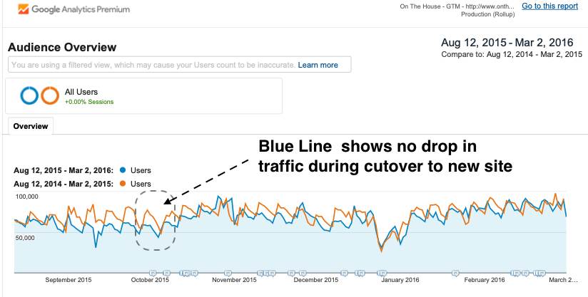

### Sophos: 2007 → 2014
  * Role: Junior Software Engineer -> Senior Software Engineer -> Interim tech lead
  * Who: [Sophos](https://www.sophos.com/) in the Sophoslabs Engineering team 
  * When: December 2007 – May 2014
  * Where: Vancouver, British Columbia + Sydney, Australia

[comment]: <> (TODO link to videos)

> We automated as much as possible, allowing our threat researchers to focus on the most challenging and valuable analysis tasks. 

Sophos is a privately held B2B provider of a broad range of computer security products. SophosLabs is responsible for generating threat intelligence for all Sophos products. I worked on a team building and maintaining production critical data publishing systems. This fast paced environment rapidly developed my coding and devops skills in a LAMP (Linux+Apache+Mysql+Perl) environment. My major accomplishments are outlined below:

**Business Rules Management** – My largest contribution to Sophos was the development of an expert rule system that still (circa 2022 after full rewrite) serves as the primary decision point for all automated sample classification within SophosLabs. The multi-worker Perl based system uses Hbase for data storage and communicates with dozens of surrounding systems via AMQP message passing. In addition to developing the system from scratch, I provided final review and approval for all updates to this system, and acted as a stakeholder/consultant in all projects directly upstream and downstream of the business rules engine. The system is now in a mature phase after going through several backend scalability upgrades and feature cycles.

The success of the system in terms of reliability, extensibility, and visibility led to repeated reuse in subsequent projects for both decision making and orchestration, growing to control state for multiple customer products. The rule set underwent over 200 successful logic updates under my supervision. In addition to developing the system from scratch, I provided final review and approval for all updates to this system, and acted as a stakeholder/consultant in all projects directly upstream and downstream of the business rules engine.

**Domain Specific Research** – My masters research had a strong overlap with my objectives at work for much of 2010 and 2011. I developed low and high interaction honeyclients (i.e., malware focused web crawlers) and performed several studies of malware distribution networks. This led to two paper publications for SophosLabs, and the research system was used in production for over a year. After completing my degree I worked with my colleagues at UBC to secure funding for research internships at Sophos. This led to hiring a PhD student on Internship to develop machine learning models to classify malware within SophosLabs.

**Improved Test and Instrumentation Practices** – I was a Test Driven Development (TDD) evangelist within the lab, and through example have passed on my love of verbose system assurance and instrumentation to my peers. Strong test coverage and maintainable test frameworks are consistent across all of my projects. Systems I have worked have consistently become easier to understand, more maintainable, and more reliable. Colleagues have adopted my methodology with positive results.

**Network reputation** – I performed many enhancements to our IP, DNS, and URL classification systems. The reliability and stability of these systems increased as a result of my efforts. I performed a consolidation of two seperate billion+ record MySQL servers, which allowed us to leverage previously unseen correlations for the purposes of classification.

**Low Interaction Honeyclient** – My first project in the lab was to design and implement a low interaction fetching agent with an integrated classification component. The objective was to classify “spam linked web content” based on an analyst written rule set. The system ran in production for over 8 years.

[comment]: <> (TODO incorporate the following:)

[comment]: <> (Project 1 - SophosLabs: UI providing structured search and faceting of malware metadata)

[comment]: <> (We began consolidating all our disparate data sources into a single Elastic Search cluster and wrote a new search interface from scratch using AngularJS, jQuery-UI, and bootstrap. This was a three person project. I was the domain expert and architect at first, and then took on the team lead role 1/2 way through the project - our manager joined the Vancouver exodus to OpenDNS. I provided feedback and reviewed all of the front-end code including the Angular pieces, but did not write this code. I was involved in this project for 12 months.)

[comment]: <> (Project 2 - SophosLabs: UI providing data visualization of file classifications)

[comment]: <> (At work my biggest achievement was building and maintaining a large rule engine that classifies &#40;clean/virus/etc&#41; all files entering SophosLabs. There are over 1500 rules organized in a hierarchy. It was very difficult for analysts to figure out why actions and classifications were made on files without a good UI. Starting in 2013 I began writing a new version of the UI to visualize the rules that have fired on each file. The UI uses a lot of D3 to generate two custom SVG based visualizations which are combined in an AngularJS single page site. I was the only developer on this project and I performed all the design, testing, and customer interaction. The result made their jobs easier. The work took me 3 months in total, which was spaced out between other activities.)

[comment]: <> (&#41;)

### University of British Columbia: 2006 → 2007
  * Role: Teaching Assistant, Substitute Lecturer
  * Who: [University of British Columbia - Electrical and Computer Engineering](https://ece.ubc.ca/)
  * When: January 2006 – December 2007
  * Where: Vancouver, British Columbia

Highlights:
  * I played the role of customer and advisor for eight groups during a fourth month HCI-focused development exercise. I evaluated requirements and design documentation, two stages of low fidelity prototyping, and provided face-to-face feedback to each group throughout the product development cycle. 
  * For three terms I provided C++ programming instruction during design of a multi-threaded elevator control system developed using Win32 libraries.
  * I gave several lectures in a fourth year undergraduate course on security.

### Autodesk LBS Division: 2003 → 2004
  * Role: Software Development / Customer Support Intern
  * Who: [Autodesk](https://www.autodesk.com/). Location Services Division : think B2B google maps before Google made Google maps.
  * When:  May 2003 – August 2004
  * Where:  Calgary, Alberta - hometown!

The Autodesk Location Based Services (LBS) Division markets an enterprise grade software platform to mobile network operators. They also have an after-sale service program in place to customize deployments and develop custom applications on top of the base software platform. I was a member of the “support and escalations” team during a 16 internship. We were effectively fire fighting across a small number of high value enterprise client installations. Our priorities changed on a daily basis depending on requirements coming from our customer sites. Aside from dealing with high-priority customer cases, I was involved in several unique customer-facing initiatives. My major accomplishments are detailed below.

**Customer Case Work** – The resolution of a case from a customer involved reproducing the problem in a simulated deployment, escalating issue(s) to core engineering, and developing, verifying, and delivering solutions to first-tier customer support. This involved a large amount of communication and compromise between different organizational units. For a high-priority case this would all take place in under two days.
* Key Result: No less than 75 issues were resolved during my time at Autodesk.

**SNMP Monitoring Implementation** – After studying the SNMP framework I investigated the existing SNMP capabilities of OEM components within our platform. I integrated all SNMP capabilities into a centralized management and monitoring console using Nagios, which is an open-sourced, Linux-based SNMP management console. 
* Key Result: The SNMP configuration was used to monitor external software deployments for Verizon and Nextel.

**Application Maintenance** – I was charged with the maintenance and upgrade of several orphaned applications. 
* Key Result: Two applications used in production systems by our European customers were successfully ported to new underlying technologies and redeployed with additional features.
    * One application is fun just because it is so dated. We developed a service for Telecom Italia: customer wants directions, customer calls a dedicated phone number. Human operator answers, they discuss the destination, operator uses Autodesk software to lookup directions, then the operator reads out the directions in one of seven supported languages to the customer. Two years later Google maps is released and this service becomes completely obsolete. 

**Certification Testing of LocationLogic platform on 64-bit Architecture** – This project involved porting enterprise grade software from a Solaris OS with Sparc hardware to Red Hat Linux running on 64-bit HP Integrity Servers (using Intel Itanium2 processors). All functionality was retested in several different hardware configurations, including a highly available system employing multiple levels of redundancy. 
* Key Result: Autodesk moved forward with a strategic alliance with HP, which positioned our division to leverage HP’s existing relationships with large carriers. In the news [here](https://gisuser.com/2004/02/autodesk-location-services-announces-worldwide-agreement-with-hp/)

### Pre Software Engineering 

#### I was a cook and a waiter !

* Joey Tomatoes – Waiter - September 2004 – August 2005
* Earl’s – Waiter, Cook - July 2000 – August 2002
* Perkin’s – Cook, Supervisor - October 1998 - June 2000

Employment in the service industry developed my time management, communication, and interpersonal skills. I believe that starting my career at a young age helped me develop an unshakeable work ethic.

#### I have done years worth of construction industry work

* Cabana Renovations - Apprentice All Purpose Home Renovator - 2001-2005
* Team Insulations - Laborer/Mover - May - August 1999

I worked many part time contracts as an apprentice for a neighbor in Calgary doing all forms of home renovation. Over a four year period I was his only employee that "didn't suck". 
In a previous job I was a general laborer I performed various jobs at SAIT during the renovation of their facilities. I was exposed to Asbestos and PCB's but it's been 20 years so I think I am in the clear. 

#### I worked for my mom

* Family Consignment Clothing Business – Clerk, Data Entry - 1996 – 1998
  	  
I started working when I was 13 years old ! I did data entry on an NCURSES based inventory platform and also sorted physical files in our customer cabinet - pre 2000 CRM. Mom eventually sold the business.

## Contract and Personal Projects

### (2016-2021) Data Visualisation - HtmlWidget Maintenance

I built and/or maintained 7 real and 2 template [R html widgets](http://www.htmlwidgets.org/) for the [DisplayR](https://www.displayr.com/) product. 

These widgets are open source, they are embedded in the Displayr SaaS product, and they can also be invoked directly from R.

In addition to either building from scratch or heavily refactoring each of these widgets, I built a development and testing framework that allows maintainers to quickly iterate in HTML and Javascript without having to use the R bindings.

Displayr is actively using the framework I built to continue to maintain the widgets.

The [rhtmlBuildUtils](https://github.com/Displayr/rhtmlBuildUtils) repo hosts the framework and documentation, as well as an list of all the widgets that are built and maintained using this framework.

  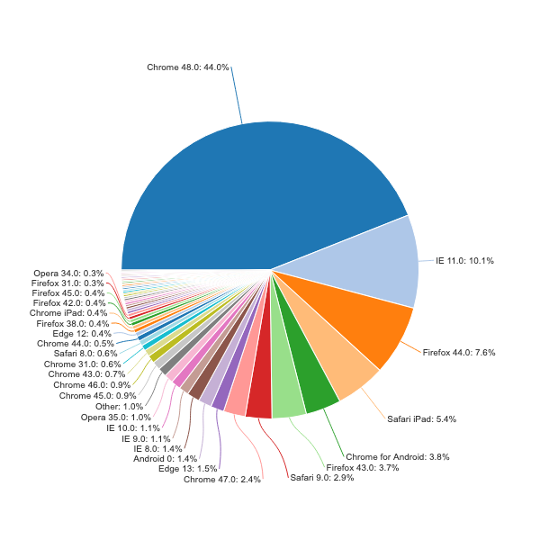
  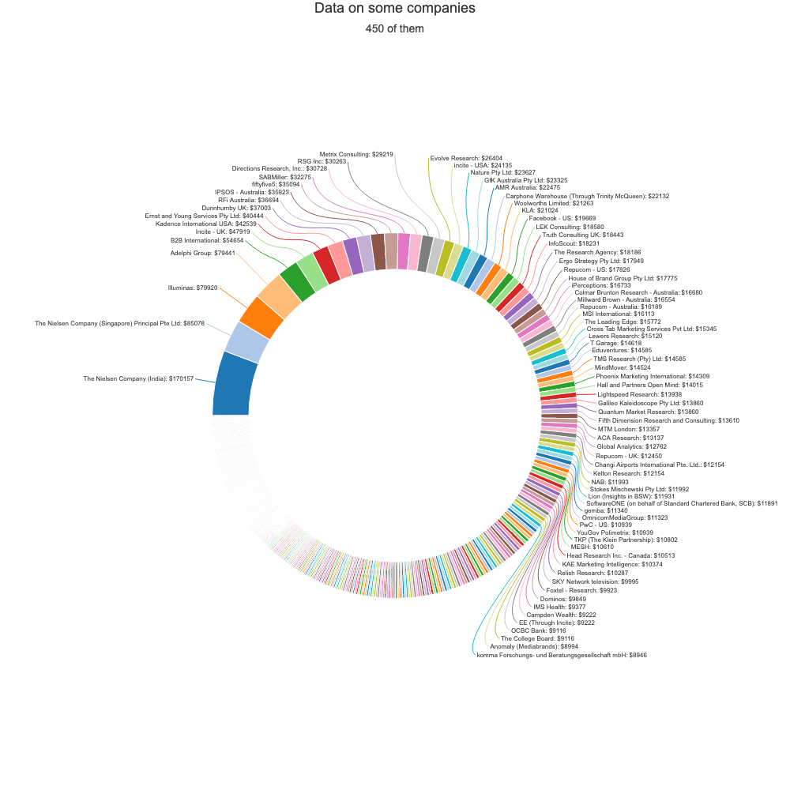
  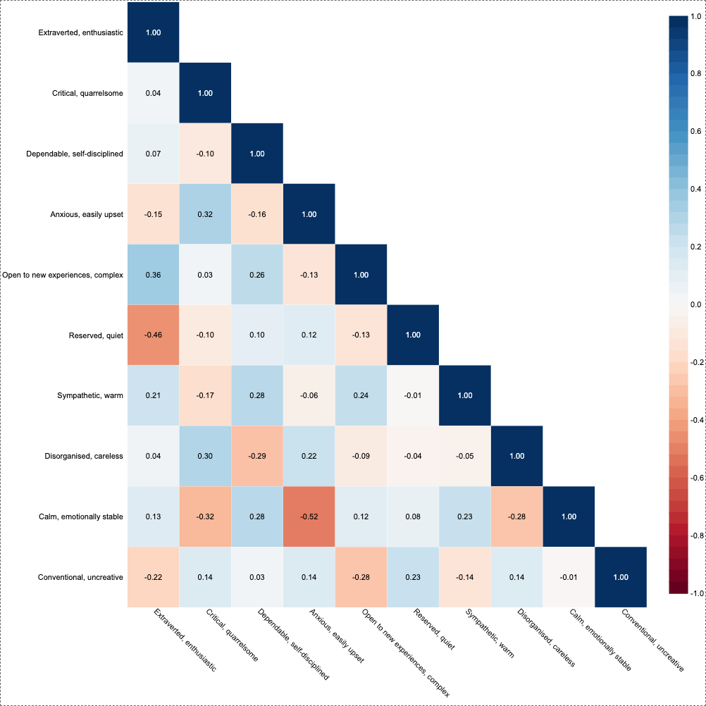
  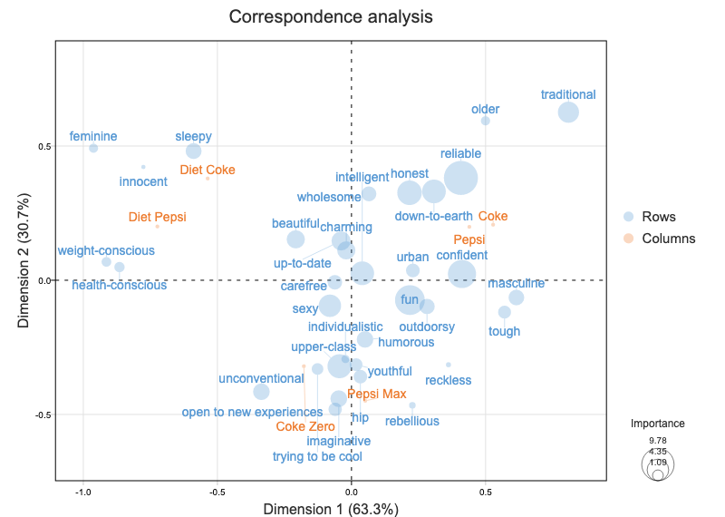
  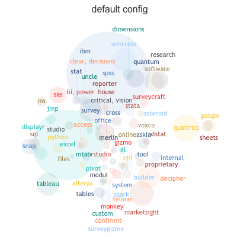
  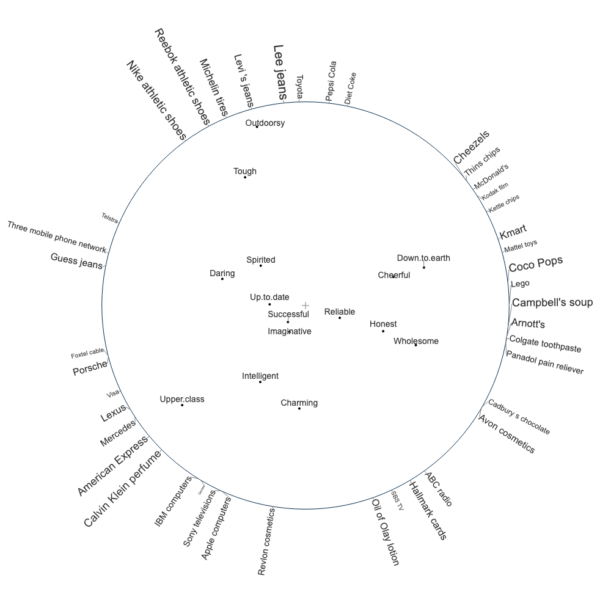
  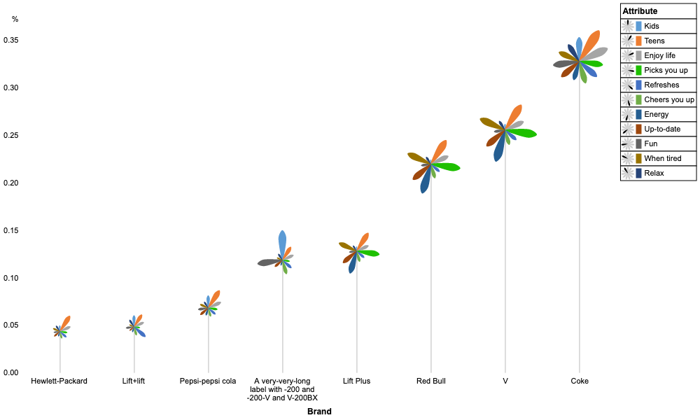
  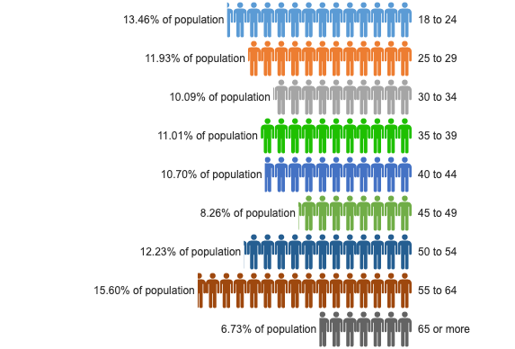
  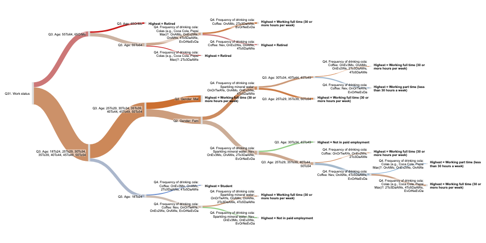

### (2021-2022) Data Science - Udacity Course Work

[Project 1: Medium Article and Repo Analysing 2020 Stackoverflow developer results](https://medium.com/@kylezeeuwen/does-the-country-change-the-developer-ce18116e905f) 

  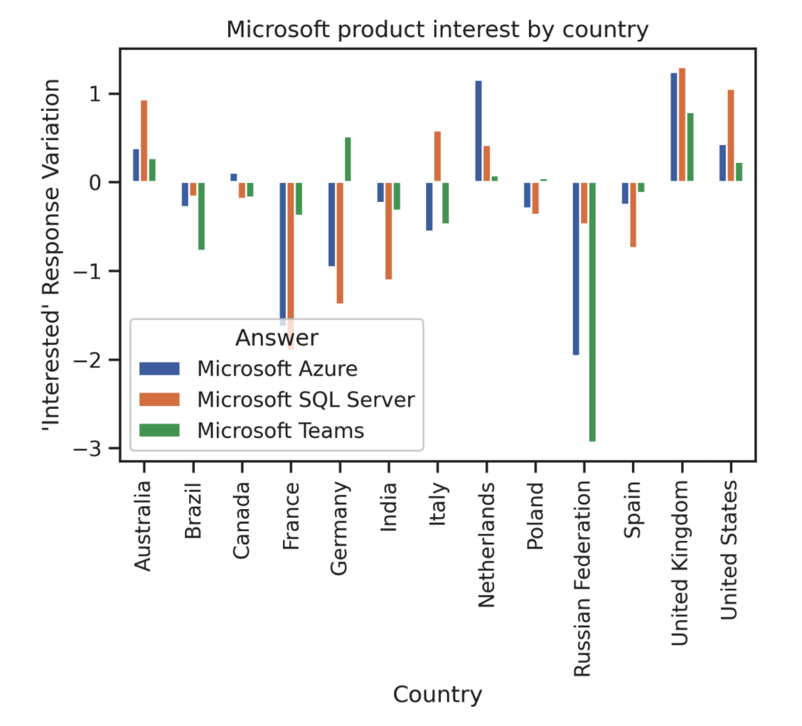

[Project 2: Build a Disaster Response Message Classifier](https://github.com/kylezeeuwen/ds-disaster-response-pipeline) 

  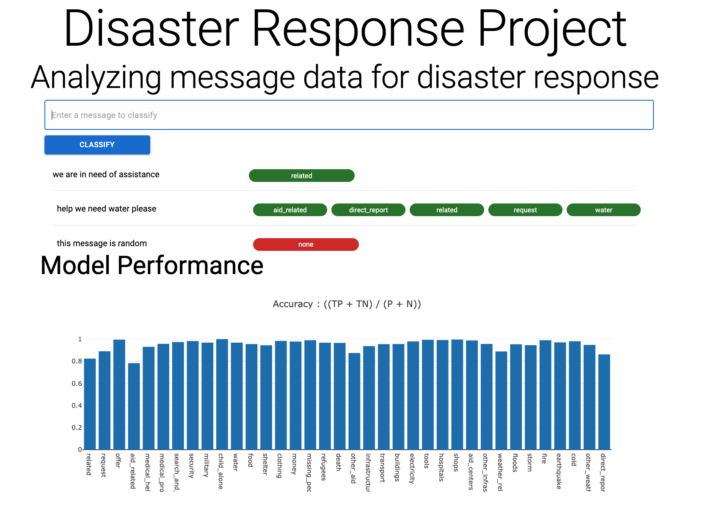

### (2015) Data Visualisation - The GymSym - Put your weights back Stu!

  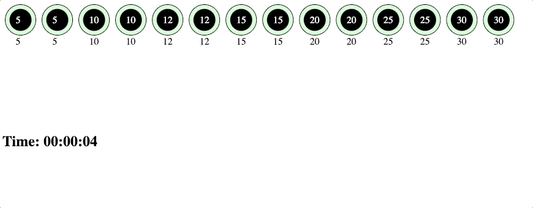

Try to show why it is bad when people put the weights back in the wrong place. [Demo](http://kylezeeuwen.github.io/gymsym/dist/).

The project includes full test coverage of the model, as well as decent npm packaging and gulp integration.

* Why: Fun. Build portfolio
* When: 2015
* What: AngularJS + D3 silly simulation
* [Code on Github](https://github.com/kylezeeuwen/gymsym)
* [Info Page URL](http://kylezeeuwen.github.io/gymsym/dist/#/intro)
* [Demo URL](http://kylezeeuwen.github.io/gymsym/dist/#/simulation/threebadapple)

### (2013-2014) Data Visualisation - NHL Trade Visualization: Visualize sports trades geographically over time.

  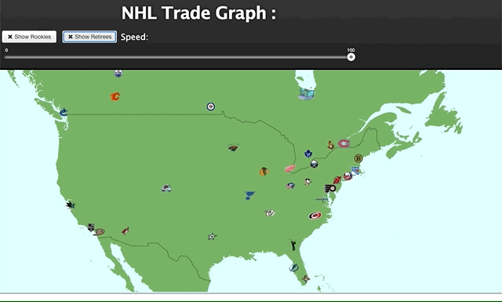

I started and 'completed' work to have public facing Angular + D3 code before getting first job hired as a front end developer. [Demo](http://kylezeeuwen.github.io/sportsgraph-alpha/demo.html)

* Why: Fun. Build portfolio
* When: 2013 - 2014
* What: AngularJS + D3 silly simulation
* [Code on Github](https://github.com/kylezeeuwen/sportsgraph-alpha)
* [Info Page URL](http://kylezeeuwen.github.io/sportsgraph-alpha/)
* [Demo URL](http://kylezeeuwen.github.io/sportsgraph-alpha/demo.html)

There is quite a bit of actual historical data underpinning this app. To get this data I had to write scrapers and run them on the sly for several weeks. Totally worth it. Web scraping and countermeasures were a common theme at Sophos.

### (2014) Scraping - olympic-medal-count

Very simple Python App : Scrape google and tell  me the Olympic medal count during the Olympics a few years ago

* Why: Fun. Info. Build portfolio
* When: 2014  
* [Code on Github](https://github.com/kylezeeuwen/olympic-medal-count)

### (2014) Diffbot Perl Client

* Why: Build portfolio. Try contract work
* Company: [Diffbot](www.diffbot.com)
* When: February 2014
* Source: oDesk
* Description: Write a Perl client for the diffbot REST service. Includes writing the module, tests, documentation, and packaging the module.
* Keywords: Perl, packaging
* Extra:
  * [Blogpost](http://blog.diffbot.com/creating-rest-api-clients-in-35-programming-languages-using-odesk/)
  * [Code on github](https://github.com/diffbot/diffbot-perl-client)

### (2014) BuildingsDB

* Company: BuildingDb - Startup 
* When: March 2014 - April 2014, 10-15 hr / week
* Description: Configured 3rd party web scrapers to pull stories from news sources, wrote North American address extractor from unstructured text. Architecture and QA advice.
* Keywords: Python

# Academic

## Education

### (Ongoing) Udacity Data Scientist Nanodegree 
  * https://www.udacity.com/course/data-scientist-nanodegree--nd025
  * 50% complete
      * [Project 1: Analyse 2020 Stackoverflow developer results](https://medium.com/@kylezeeuwen/does-the-country-change-the-developer-ce18116e905f) 
      * [Project 2: Build a Disaster Response Message Classifier](https://github.com/kylezeeuwen/ds-disaster-response-pipeline) 

### MASc. Computer Engineering
  * Where/When : University of British Columbia - 2011
  * Thesis Topic: Optimizing re-evaluation of malware distribution networks
  * Overview : I built honeyclients to study the update patterns and countermeasures used by the distributors of malware. My research system was used in production by SophosLabs for almost a year to keep up with the Fake AV threat, led to two publications, and provided techniques to improve the efficiency of honeyclient systems.

### BSc. Software Engineering with Distinction
  * University of Calgary - 2005
  * Graduated with Distinction - GPA 3.8
  * Overview: my classmates are employed throughout N. America. We were a close and highly collaborate group. 90%+ agree that they owe me more than I owe them. 20 years later I still drink for free at most meetups

## Publications

* [Strategies for Monitoring Fake AV Distribution Networks](http://lersse-dl.ece.ubc.ca/record/267/files/267.pdf)
  * In Virus Bulletin 2011, Barcelona, Spain, October 5-7, 2011.
  * O. Komili, K. Zeeuwen, M. Ripeanu, and K. Beznosov. 

* [Improving Malicious URL Re-Evaluation Scheduling Through an Empirical Study of Malware Download Centers](http://lersse-dl.ece.ubc.ca/record/257/files/257.pdf)
  * In WebQuality 2011, Hyderabad, India, April 28, 2011.
  * K. Zeeuwen, M. Ripeanu, and K. Beznosov.

* [Optimizing Re-Evaluation of Malware Distribution Networks](http://lersse-dl.ece.ubc.ca/record/268/files/268.pdf)
  * University of British Columbia MASc. Thesis. October 2011.
  * K. Zeeuwen. 
    
* [Augur: Aiding Malware Detection Using Large-Scale Machine Learning](http://lersse-dl.ece.ubc.ca/record/278/files/278.pdf)
  * Y. Boshmaf, M. Ripeanu, and K. Beznosov, K. Zeeuwen, D Cornell, D Samosseiko
  * At the Poster Session of the 21st Usenix Security Symposium, Bellevue, WA, 2012

### Queensland Smoke Alarm Legislation Compliance 2021 

I performed some analysis to estimate how many queensland properties were compliant ahead of new smoke alarm safety legislation in QLD. Our data got carried in the Courier Mail New Years Day 2022 [Page 1 lead in](../assets/news/queensland_smoke_alarm_compliance_2022/courier-mail-2022-01-01-page1.jpeg) to a [2 page spread on Page 4-5](../assets/news/queensland_smoke_alarm_compliance_2022/courier-mail-2022-01-01-page4-5.png). Earlier, the initial data release months prior was also picked up [online](../assets/news/queensland_smoke_alarm_compliance_2022/courier-mail-online-2021-11-21.pdf)

## Academic Awards

* Graduate Entrance Scholarship (Graduate Studies)
* Faculty of Science Entrance Award (Graduate Studies)
* NSERC PGS-M (Graduate Studies)
* University of Calgary Engineering Dean’s List (2nd-4th year undergrad)
* Verity Inc. Scholarship in Software Engineering (3rd year undergrad)
* Louise Mckinney Scholarship (3rd year undergrad)
* Alberta Heritage Jason Lang Scholarship (2nd-3rd year undergrad)
* Alberta Heritage Rutherford Scholarship (1st year undergrad)
* Chevron Canada Renewable Scholarship (1st-4th year undergrad)
* Mobil Oil Renewable Scholarship (1st-4th year undergrad)

## Referee (Reviewer) for Publications:
Although Dr. Konstanin Beznosov made the final referee decision, I served as a first reviewer for the following publications:

* IEEE Software: Special issue on “Security for the Rest of Us” - January/February 2008    			
* SACMAT - ACM Symposium on Access Control Models and Technologies - 2006, 2007
* SOUPS - Symposium on Usable Privacy and Security - 2006, 2007
* ACSAC - Annual Computer Security Applications Conference - 2006, 2007
* NSPW - New Security Paradigms Workshop – 2006

# Talking Points / Why Me

* Sharp: First one to identify the bug. By juggling more relevant bits than the engineer beside me and having deeper associative chains, I identify the issue first 90% of the time.
* Pragmatic: In every review at every job, the words pragmatic have been used in a positive light. I love to produce perfect systems but recognize that Rome was not built in a day. I have a very discerning eye for what can be deferred and what must be immediately addressed.
* Patient: I am comfortable in environments where I need to spend time to explain a complex dependency chain, make my case (and listen to others!) on an important design decision, or simply explain how it all fits together to a non-technical colleague. My patience in these situations increases as the years pass. Recently, I have noticed people call me patient! More like getting old.
* Team Player: I enjoy training and troubleshooting with my colleagues. It brings me great joy to be sought after for advice and help in times of need. Similarly, seeing someone successfully applying a technique that I have taught is very satisfying.
* Trainer: Teaching and tutoring experience developed while helping coworkers and classmates, presenting in product and technical showcases, mentoring peers as practice lead, supervising undergraduate labs, and occasionally lecturing undergraduate courses.
* Soft Skills: Excellent set developed as waiter, working in highly interactive development environments, working trades in my teens, and being raised right by Mom.
* Strong background in information security fundamentals and software engineering

