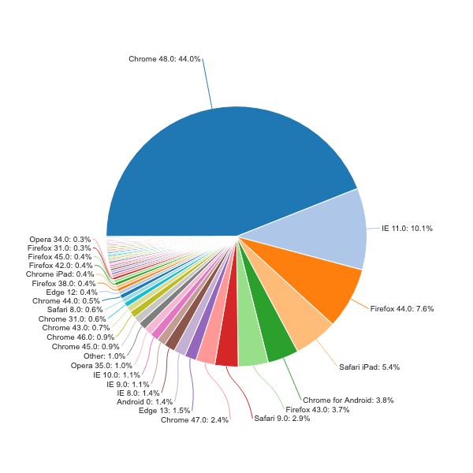
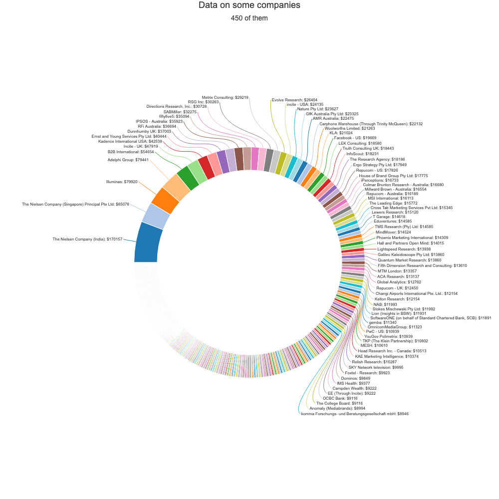
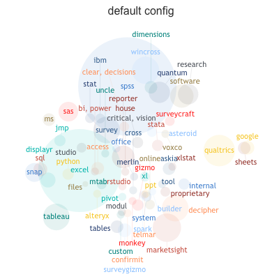
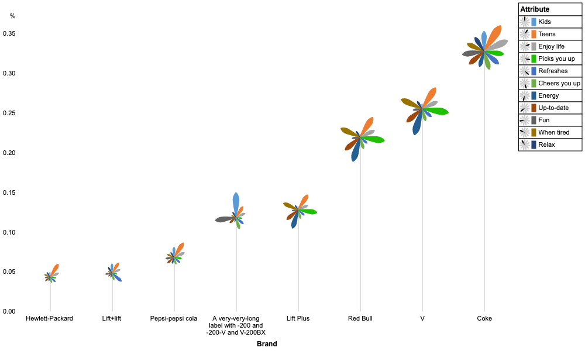

# Overview

Welcome! This is the short format of Kyle Zeeuwen's resume. The [long version](./long_format.md) provides a more complete picture, but it is verbose.

Did you know: github markdown viewer include a table of contents / header summary  (↗ over there ↗)

# Technologies

## Languages
* python - Intermediate - 5 year
* nodejs/javascript - Advanced - 10+ year
* HTML5/CSS - Intermediate - 10+ year 
* C/C++ - Beginner - 3 year
* Java - Beginner - 1 year
* perl - Advanced, but never again - 6 year

## Database
* MySQL - Advanced - 14+ year
* hadoop + Hbase - 2 year
* elasticsearch - Beginner - 3 year
* postgres/redshift - Beginner - 3 year
* Neo4j - Beginner - 1 year

## Data Engineering / Data Science Frameworks 
* DBT - Intermediate - 3 year
* Pandas / Numpy / ScikitLearn - Beginner - 1 year

## Build/Devops
* git - advanced - 10+ year
* AWS - Novice/Intermediate - 5 year
* Ansible - Beginner - 3 year
* Nagios - Advanced - 6 year
* Jenkins - Intermediate - 6 year

# Experience

## Reapit - 2014 → Present
  * Role: Front End Developer → Tech Lead → Practice Lead → Squad Lead → Squad Lead Coordinator → Data Engineer
  * Who: [Reapit ANZ](https://www.reapit.au/discover/) formerly [Console](https://www.console.com.au/) formerly [OnTheHouse](https://www.onthehouse.com.au/)
  * When: May 2014 - Present
  * Where: Sydney, Australia + Brisbane, Australia

It's been an 10 year journey spanning two cities, 6 CEOs, 6 roles, and two complete rewrites of legacy products: the [www.onthehouse.com.au](www.onthehouse.com.au) site and the [Console Cloud property management platform](https://www.console.com.au/products/cloud/). From late 2020, I stepped away from a technical leadership role and focused on Data Engineering.

### Data Team : 2020 → present

By late 2020 we were big enough to justify focus on data curation and revenue operations. I began focusing in this space, eventually carving out a dedicated role. Major achievements:

* **CRM Consolidation from Xero into Salesforce**: Console, Agentbox, and Agentpoint were all acquired by Reapit. I was heavily involved in a one year effort to consolidate CRMs and billing from 2x Xero and 2x Salesforce into a single Salesforce Org to rule them all.
* **Single View Of Customer**: I have maintained a single view of client in our warehouse during multiple acquisitions and business system consolidation projects. Over 100 internal users base wrokflow on top of the single client view provided by the warehouse
* **Deep Dive Usage Data**: I built rich usage dashboards that summarise client activity in the Console Cloud product. This tool is used as an engagement tool to facilitate better client relationships.
* **Eliminate Revenue Leakage**: Integrate our production SaaS product with Salesforce billing to ensure we charge for all services and products that are delivered. Over 2 years I have recovered +$70k/month worth of revenue, and drastically improved our process and data quality in this space.
* **BAU Business Intelligence**: Daily updates to our data pipeline to satisfy Account Management, Finance, product engineering, and business systems.

### Console Cloud: Inception → Stable Product : 2016 → 2020

In March 2016 Console work to replace our on premises property management software package called Gateway. The new SaaS solution provides a website and mobile apps for property managers, landlords, and tenants. We went live with 1 beta client in February 2017 and by early 2022 had migrated all legacy clients onto the new software. The success and stability of the new platform led to [accquisition of Console by AKKR](https://www.reapit.com/press-releases/reapit-expands-portfolio-with-acquisition-of-leading-australian-proptech-company-console/).

#### Technology Stack
* Web: Combination of "micro front ends" written in React with older code written in AngularJS.
* Middle Tier: Nodejs based BFF layers providing GraphQL, Authentication, Service Discovery, and Orchestration capabilities - keep the front end simple(ish).
* Backend: Springboot Microservice APIs written in Kotlin using Aurora Mysql and Elastic Search for data persistence.

#### Personal Timeline

I have performed a variety of roles which are listed below. Note newest to oldest for ease of skimming.

* **2019: Deputy Head of Engineering**: We grew to over 10 squads including offshore teams, and I stepped into a coordination role. I spent my day listening, observing, and looking for synergies achieved via juggling priorities, careful scoping, and resource shuffling. Note that "Deputy Head of Engineering" is a self appointed title! 

* **2018: Squad lead**: we changed our development structure to follow the ["Spotify Model"](https://www.youtube.com/watch?v=Yvfz4HGtoPc) to empower integrated engineering+product teams with more decision making. I became one of 5 squad leads and focused on full stack tech leadership for specific feature streams. I got to pick first so naturally my squad was the A Team 😎

* **2017: Front End Practice lead**: we expanded development capacity to 13 front end developers + multiple in house thoughtworks teams. I coordinated all front end efforts, and focused on that difficult balance bewteen consistency and automonomy and growing leaders in the space.

* **2016: Front end tech lead**: From dev day 0 through to one year in production: built the foundations of the new SaaS product and the development ecosystem. I was heavily involved in the Angular 1.x framework, the nodejs + graphql middle tier (aka "BFF"), the analytics layer, the Protractor testing framework, and the Jenkins + docker based CI/CD build pipeline.

#### Key achievements (newest to oldest)

* **First Communications Release**: I spent 3 quarters as squad lead developing our email+sms+templating capabilities. This closed a major capability gap that helped us complete against other industry players. 
* **Lease Renewal Workflow**: The first feature I contributed to as squad lead is still the most adopted "optional" feature within the platform. 
* **Angular → React**: In early 2016 I made the decision to use AngularJS over React. In retrospect this was not the right decision. In July 2018 I achieved business buy in to begin moving us to React 😮‍💨.

### OnTheHouse rewrite: 2014 → 2016:

[OnTheHouse](www.onthehouse.com.au) is an Australian real estate portal that provides a rich collection of current and historical real estate data. I was the technical lead on a team of 10 professionals rewriting the www.onthehouse.com.au website from a PHP stack to an AngularJS stack. Our team developed the client code, the node.js server stack, and the AWS infrastructure. The rewrite took 18 months and went live in October 2015.

First leadership role. I took particular focus on our testing frameworks, server stack, dev-ops process, and SEO concerns during the migration to the new site.

**Notable key individual contributions**: the site migration and relaunch went very smoothly. Our organic search traffic, which was spread across 15 million distinct pages and was critical to the site, did not even take a temporary 2-3 week drop as was expected by our SEO consultants. The solution involved a data driven permanent redirect service, a sitemap generator capable of itemising over 15M pages, and a prerendering solution to make it very easy for google to crawl these new pages.

  
  

## Sophos: 2007 → 2014
  * Role: Junior Software Engineer -> Senior Software Engineer -> Interim tech lead
  * Who: [Sophos](https://www.sophos.com/) in the Sophoslabs Engineering team 
  * When: December 2007 – May 2014
  * Where: Vancouver, British Columbia + Sydney, Australia

> We automated as much as possible, allowing our threat researchers to focus on the most challenging and valuable analysis tasks. 

Sophos is a privately held B2B provider of a broad range of computer security products. SophosLabs is responsible for generating threat intelligence for all Sophos products. I worked on a team building and maintaining production critical data publishing systems. This fast paced environment rapidly developed my coding and devops skills in a LAMP (Linux+Apache+Mysql+Perl) environment. My major accomplishments are outlined below:

**Business Rules Management** – My largest contribution to Sophos was the development of an expert rule system that served as the primary decision point for all automated sample classification within SophosLabs. The multi-worker Perl based system used Hbase for data storage and communicated with dozens of surrounding systems via AMQP message passing. After developing the system from scratch and bringing it to production, for two years I provided oversight to all ruleset updates, and implemented most of the engine enhancements.During this time I also served as a stakeholder/consultant in all projects directly upstream and downstream of the business rules engine. The system lasted almost 10 years in production; \* My™️ Perl version was rewritten in 2022 but carries on in spirit.

**Domain Specific Research** – My masters research overlapped with work for much of 2010 and 2011. I developed low and high interaction "honeyclients" (i.e., malware focused web crawlers) and performed several studies of malware distribution networks. This led to two paper publications for SophosLabs, and the research system was used in production for over a year. After completing my degree I worked with my colleagues at UBC to secure funding for research internships at Sophos. This led to hiring a PhD student on Internship to develop machine learning models to classify malware within SophosLabs.

## University of British Columbia: 2006 → 2007
  * Role: Teaching Assistant, Substitute Lecturer

## Autodesk LBS Division: 2003 → 2004
  * Role: Software Development / Customer Support Intern
  * Who: [Autodesk](https://www.autodesk.com/). Location Services Division : think B2B google maps before Google made Google maps.
  * When:  May 2003 – August 2004
  * Where:  Calgary, Alberta - hometown!

The Autodesk Location Based Services (LBS) provided software solutions to mobile network operators. During a 16 internship I worked in the professional services team that managed the per client customisations built on top of the core product. Lots of fire fighting in high value enterprise client installations. Shared an office with a crusty Unix admin for over a year and levelled up quickly.

## Pre Software Engineering 

* I was a cook and a waiter !
* I did years of construction industry work
* I worked for my mom doing filing and book keeping starting at 13 years old

## Contract and Personal Projects

Lots. See the [long format resume project section](./long_format.md#contract-and-personal-projects) for a curated version that is easier than browsing github. I am particularly proud of all the data visualisation contract work I performed for [DisplayR](https://www.displayr.com/).

  
  
  
  
  
  
  
  
  

# Academic

## Education

Details in [long format resume education section](https://github.com/kylezeeuwen/resume/blob/main/dist/long_format.md#education)

* (ongoing) Udacity Data Scientist Nanodegree 
* MASc. Computer Engineering - University of British Columbia - 2011
* BSc. Software Engineering with Distinction - University of Calgary - 2005

## Publications

4 security research related publications: 1 peer reviewed, 1 non reviewed, 1 poster, 1 thesis. See [long format resume publications section](https://github.com/kylezeeuwen/resume/blob/main/dist/long_format.md#contract-and-personal-projects)