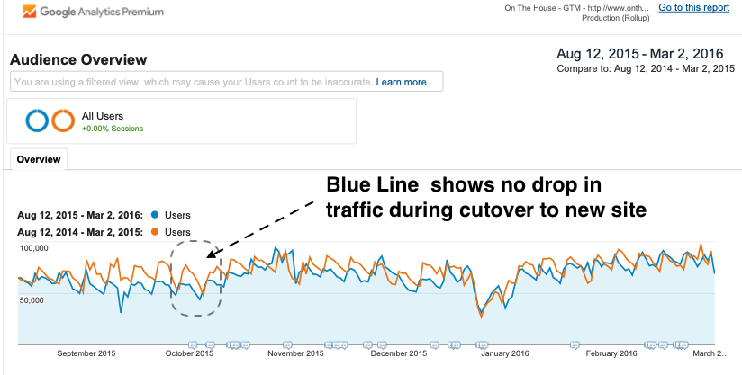
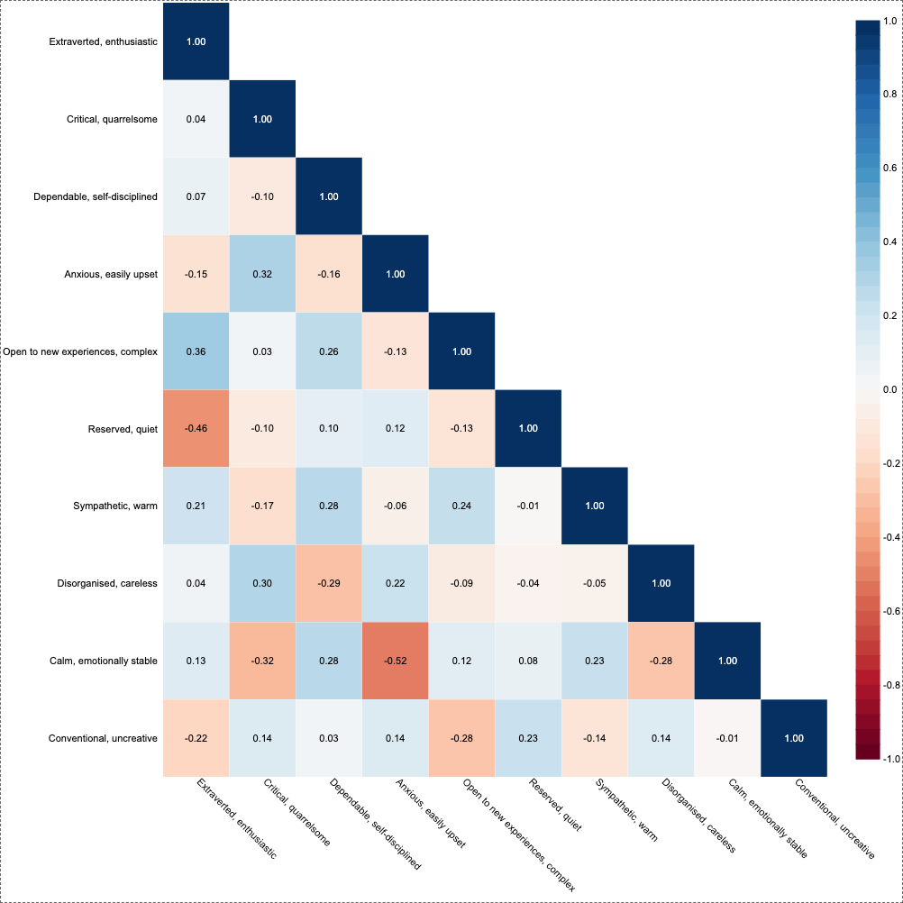
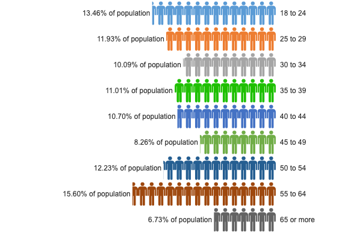

# Overview

Welcome! This is the short format of Kyle Zeeuwen's resume. The [long version](./long_format.md) provides a more complete picture, but it is verbose.

Did you know: github markdown viewer include a table of contents / header summary  (↖ over there ↖)

# Technologies

## Languages
* javascript - Advanced - 10+ year
* nodejs - Advanced - 10+ year
* perl - Advanced - Never again - 6 year
* python - Novice/Intermediate - 5 year
* HTML5/CSS - Intermediate - 10+ year 
* Java - Beginner - 1 year
* C/C++ - Beginner - 3 year

## Database
* MySQL - Advanced - 14+ year
* hadoop + Hbase - 2 year
* elasticsearch - Beginner - 3 year
* redshift - Beginner - 3 months

## Javascript / Nodejs Frameworks
* AngularJS (1.x) - Advanced - 10+ year
* React - Intermediate - 4+ year
* D3 - Novice/Intermediate - 3 year
* Grunt/Gulp Tooling - Advanced - 5 year
* Protractor - Intermediate - 4 year
* Testing with chai/sinon/mocha or jasmine - 4 year
* Puppeteer - Beginner - 2 year

## Data Engineering / Data Science Frameworks 
* DBT - Beginner - 4 months
* Pandas / Numpy / ScikitLearn - Beginner - 1 year

## Build/Devops
* git - advanced - 8 year
* AWS - Novice/Intermediate - 5 year
* Ansible - Beginner - 3 year
* Nagios - Advanced - 6 year
* Jenkins - Intermediate - 6 year
* Perforce - 6 year
* Linux packaging - 2 year

# Experience

## Full Time Employment

### Console - 2014 → Present
  * Role: Front End Developer → Tech Lead → Practice Lead → Squad Lead → Squad Lead Coordinator → Data Guy
  * Who: [Console](https://www.console.com.au/) formerly [OnTheHouse](https://www.onthehouse.com.au/)
  * When: May 2014 - Present
  * Where: Sydney, Australia + Brisbane, Australia

It's been an 8 year journey spanning two cities, 5 CEOs, 6 roles, and two complete rewrites of legacy products: the [www.onthehouse.com.au](www.onthehouse.com.au) site and the [Console Cloud property management platform](https://www.console.com.au/products/cloud/).

As the two product builds were effectively two completely different experiences, I have separated them below.

#### Console Cloud: Inception → Stable Product → Acquisition : 2016 → present

In March 2016 Console began a program of work to replace an on premises property management software package called Gateway. The new solution was SaaS based consisting of a website and mobile apps for property managers, landlords, and tenants. We went live with 1 beta client in February 2017 and by early 2022 have onboarded over 95% of the legacy clients onto the new software. The success and stability of the new platform led to [accquisition of Console by AKKR](https://www.reapit.com/press-releases/reapit-expands-portfolio-with-acquisition-of-leading-australian-proptech-company-console/).

##### Technology Stack
* Web: Combination of "micro front ends" written in React with older code written in AngularJS.
* Middle Tier: Nodejs based BFF layers providing GraphQL, Authentication, Service Discovery, and Orchestration capabilities - keep the front end simple(ish).
* Backend: Springboot Microservice APIs written in Kotlin using Aurora Mysql and Elastic Search as a datastore.

##### Personal Timeline

During this 6 years I have performed a variety of roles which are listed below.   

* **Front end tech lead**: built the foundations of the new SaaS product and the development ecosystem. I was heavily involved in the Angular 1.x framework, the nodejs middle tier (aka "BFF"), the analytics layer, the Protractor testing framework, and the Jenkins + docker based CI/CD build pipeline.

* **Practice lead**: we expanded development capacity to 13 front end developers + multiple in house thoughtworks teams. I coordinated all front end efforts, and focused on that difficult balance bewteen consistency and automonomy and growing leaders in the space. 
  
* **Squad lead**: we changed our development structure to follow the ["Spotify Model"](https://www.youtube.com/watch?v=Yvfz4HGtoPc) in an attempt to empower our engineering teams with more decision making. I became one of 5 squad leads and focused on full stack tech leadership for specific feature streams.
 
* **Squad lead coordinator (Deputy Head of Engineering)**: We grew to over 10 squads including offshore teams, and I stepped into a "coordination" role. The head of engineering wasn't keen on my proposed "Deputy Head of Engineering" title but this is my resume not his! I spent my day listening, observing, and looking for synergies achieved via juggling priorities, careful scoping, and resource shuffling.

* **Data guy**: We were big enough at this point to require focus on data pipelines, and revenue operations, so I began focusing in this space and eventually made the case to create a dedicated role. This is my current role and I could not be happier.  

##### Key achievements

* **Angular → React**: In early 2016 I made the decision to use AngularJS over React. In retrospect this was not the right decision. In July 2018 I achieved business buy in to begin moving us to React 😮‍💨.
* **Lease Renewal Workflow**: The first feature I contributed to as squad lead is still the most adopted "optional" feature within the platform. 
* **First Communications Release**: I spent 3 quarters as squad lead developing our email+sms+templating capabilities. This closed a major capability gap that helped us complete against other industry players. 
* **Revenue Leakage**: I found so much of a gap between our contract+billing data and our actual usage data that I dropped everything and worked in this space for 18 months. I recovered $50k/month worth of revenue stream and drastically improved our process and data quality in this space.
* **Account dashboards**: I produced a low cost data pipeline that combines a sanitised production replica, our CSM data, and our analytics stream in one data store and serves reports using [Metabase](https://www.metabase.com/). This `data shack` (™) serves our account managers and service teams. Before they had to ask clients which features they were paying for ?! Now they can have meaningful conversations about how clients are using our platform and suggest avenues for improvement. Aside from empowering 1/3 of our company, this demonstrated the business case for investing in a "real data warehouse 💸💸".

#### OnTheHouse rewrite: 2014 → 2016:

[OnTheHouse](www.onthehouse.com.au) is an Australian real estate portal that provides a rich collection of current and historical real estate data. I was the technical lead on a team of 10 professionals rewriting the www.onthehouse.com.au website from a PHP stack to an AngularJS stack. Our team developed the client code, the node.js server stack, and the AWS infrastructure. The rewrite took 18 months and went live in October 2015.

I became an expert in a new tech stack, and spent my time mentoring, reviewing, and troubleshooting with my peers, drafting solutions with our chief architect, iterating on story details with our business analysts, and contributing to several key areas of our code base. I took particular focus on our testing frameworks, server stack, dev-ops process, and SEO concerns during the migration from old to new site. The technology soup that I ate during this project : Angular 1.2 via coffeescript, testing via protractor, jasmine, and karma, CSS3 via LESS, grunt, prerender, node.js express, CI via Jenkins, AWS via an in house cloud formation templating DSL, Kibana, and JIRA+Confluence.

**Notable key individual contributions**: the site migration and relaunch went very smoothly. Our organic search traffic, which was spread across 15 million distinct pages and was critical to the site, did not even take a temporary 2-3 week drop as was expected by our SEO consultants. The solution involved a data driven permanent redirect service, a sitemap generator capable of itemising over 15M pages, and a prerendering solution to make it very easy for google to crawl these new pages.

  
  

### Sophos: 2007 → 2014
  * Role: Junior Software Engineer -> Senior Software Engineer -> Interim tech lead
  * Who: [Sophos](https://www.sophos.com/) in the Sophoslabs Engineering team 
  * When: December 2007 – May 2014
  * Where: Vancouver, British Columbia + Sydney, Australia

> We automated as much as possible, allowing our threat researchers to focus on the most challenging and valuable analysis tasks. 

Sophos is a privately held B2B provider of a broad range of computer security products. SophosLabs is responsible for generating threat intelligence for all Sophos products. I worked on a team building and maintaining production critical data publishing systems. This fast paced environment rapidly developed my coding and devops skills in a LAMP (Linux+Apache+Mysql+Perl) environment. My major accomplishments are outlined below:

**Business Rules Management** – My largest contribution to Sophos was the development of an expert rule system that still (circa 2022 after full rewrite) serves as the primary decision point for all automated sample classification within SophosLabs. The multi-worker Perl based system uses Hbase for data storage and communicates with dozens of surrounding systems via AMQP message passing. In addition to developing the system from scratch, I provided final review and approval for all updates to this system, and acted as a stakeholder/consultant in all projects directly upstream and downstream of the business rules engine. The system is now in a mature phase after going through several backend scalability upgrades and feature cycles.

The success of the system in terms of reliability, extensibility, and visibility led to repeated reuse in subsequent projects for both decision making and orchestration, growing to control state for multiple customer products. The rule set underwent over 200 successful logic updates under my supervision. In addition to developing the system from scratch, I provided final review and approval for all updates to this system, and acted as a stakeholder/consultant in all projects directly upstream and downstream of the business rules engine.

**Domain Specific Research** – My masters research had a strong overlap with my objectives at work for much of 2010 and 2011. I developed low and high interaction honeyclients (i.e., malware focused web crawlers) and performed several studies of malware distribution networks. This led to two paper publications for SophosLabs, and the research system was used in production for over a year. After completing my degree I worked with my colleagues at UBC to secure funding for research internships at Sophos. This led to hiring a PhD student on Internship to develop machine learning models to classify malware within SophosLabs.

**Improved Test and Instrumentation Practices** – I was a Test Driven Development (TDD) evangelist within the lab, and through example have passed on my love of verbose system assurance and instrumentation to my peers. Strong test coverage and maintainable test frameworks are consistent across all of my projects. Systems I have worked have consistently become easier to understand, more maintainable, and more reliable. Colleagues have adopted my methodology with positive results.

### University of British Columbia: 2006 → 2007
  * Role: Teaching Assistant, Substitute Lecturer

### Autodesk LBS Division: 2003 → 2004
  * Role: Software Development / Customer Support Intern
  * Who: [Autodesk](https://www.autodesk.com/). Location Services Division : think B2B google maps before Google made Google maps.
  * When:  May 2003 – August 2004
  * Where:  Calgary, Alberta - hometown!

The Autodesk Location Based Services (LBS) Division markets an enterprise grade software platform to mobile network operators. They also have an after-sale service program in place to customize deployments and develop custom applications on top of the base software platform. I was a member of the “support and escalations” team during a 16 internship. We were effectively fire fighting across a small number of high value enterprise client installations. Our priorities changed on a daily basis depending on requirements coming from our customer sites. Aside from dealing with high-priority customer cases, I was involved in several unique customer-facing initiatives. My major accomplishments are detailed below.

### Pre Software Engineering 

* I was a cook and a waiter !
* I have done years worth of construction industry work
* I worked for my mom

## Contract and Personal Projects

Lots. See the [long format resume project section](./long_format.md#contract-and-personal-projects) for a curated version that is easier than browsing github.

  
  
  
  
  
  
  
  
  

# Academic

## Education

Details in [long format resume education section](https://github.com/kylezeeuwen/resume/blob/main/dist/long_format.md#education)

* (ongoing) Udacity Data Scientist Nanodegree 
* MASc. Computer Engineering - University of British Columbia - 2011
* BSc. Software Engineering with Distinction - University of Calgary - 2005

## Publications

4 security research related publications: 1 peer reviewed, 1 non reviewed, 1 poster, 1 thesis. See [long format resume publications section](https://github.com/kylezeeuwen/resume/blob/main/dist/long_format.md#contract-and-personal-projects)